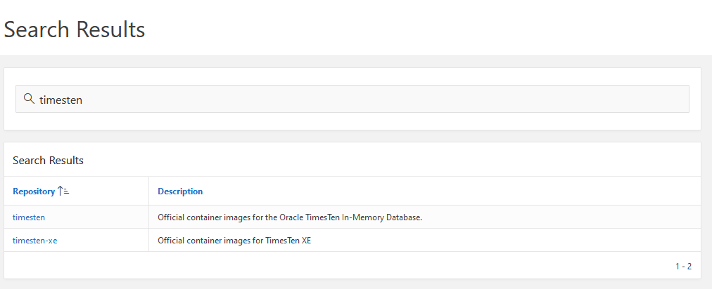
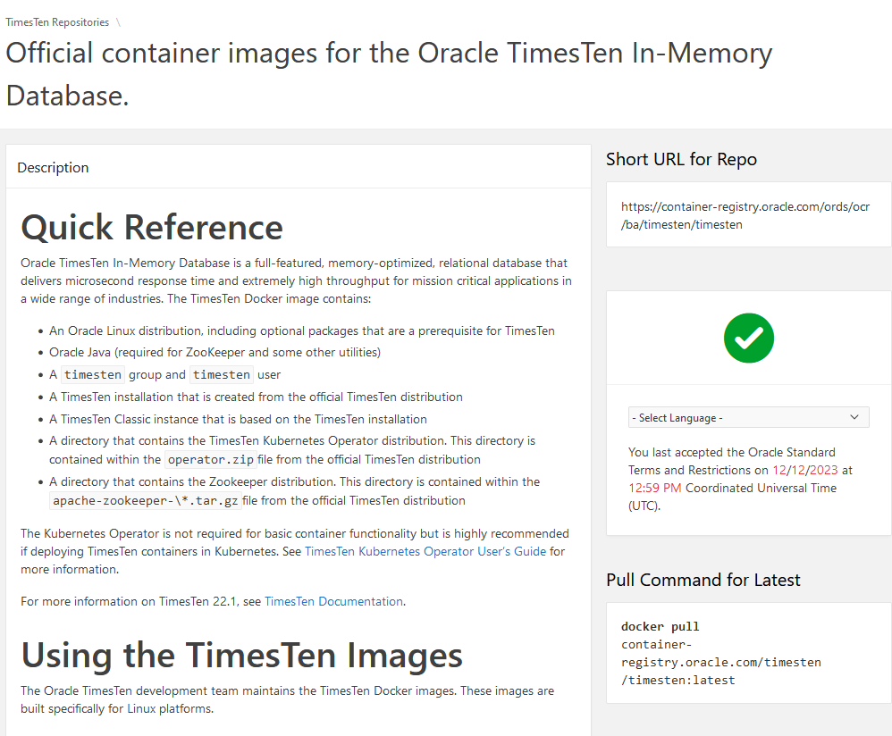

# Install the Oracle Database Kubernetes Operator

## Introduction


A Kubernetes Operator (also called Operator) is the brains behind a CRD.
An Operator is an application that performs the functions of a human computer operator.
It starts, stops, monitors, and manages other applications.

An Operator runs in one or more Pods, one active and the others idle. The active Operator performs the work.
The remaining Operators are idle and remain idle until the active Operator fails.
The active Operator manages all objects of a particular type and when combined with a CRD enables you to add custom facilities to Kubernetes.

The TimesTen Kubernetes Operator consists of these interrelated components:

- Custom Resource Definitions (CRDs): There are two CRDs. The TimesTenClassic CRD
defines an object of type TimesTenClassic to Kubernetes. This TimesTenClassic
object type provides the metadata for deploying active standby pairs of TimesTen Classic databases.

- TimesTen Operator: There is one TimesTen Operator. The Operator monitors and handles the TimesTenClassic
objects. It deploys, manages, and monitors active standby pairs of TimesTen Classic database.

- TimesTen Agent: There is one TimesTen agent. This agent runs inside each container that runs TimesTen.
The TimesTen Operator communicates with these agents both to determine the state of
TimesTen insides of the container as well as to create, start, stop, and control TimesTen instances.
The agent does not know how to manage TimesTen. It gives information to the Operator and the Operator provides the instructions for the agent.
This agent knows how to work with TimesTen Classic.

This lab walks you through the steps to install the *TimesTen Kubernetes Operator* using the CLoud Shell.

Estimated Time: 15 minutes

## Task 1: Prepare to pull the DB Docker image
The official TimesTen container images are located on the Oracle Container Registry
at https://container-registry.oracle.com/. To use a licensed Oracle software image such as TimesTen,
you must log into the Oracle Container Registry web interface and accept the Oracle Standard Terms and Restrictions for the image.
After you complete the following steps, you can reference the official TimesTen container image in your YAML manifest files.

1. Navigate to the [Oracle Container Registry](https://container-registry.oracle.com/) and log in with your Oracle account.
    > **Attention**: This is **not** your Cloud account but the account you used to register to the Oracle website, sign up for events or download software.

    

2. Sign in with your Oracle account

3. On the Oracle Container Registry page, in the Browse Containers section, click TimesTen.

  

4. On the TimesTen Repositories page, in the Repository column, choose timesten.

4. On the *Official container images for the Oracle TimesTen In-Memory Database* page,
to the right of the *Quick Reference Description*, locate the *Select Language* drop down list.
In the Select Language drop down list, choose *your language*. Then, review the text
before the *Continue* button and click *Continue*.

    The text that is displayed before the Continue button is similar to the following:
    "*You must agree to and accept the Oracle Standard Terms and Restrictions prior to downloading from the Oracle Container Registry. Please read the license agreement on the following page carefully.*"


5. On the Oracle Standard Terms and Restrictions page, review the information on the page,
then at the bottom of the page, click Accept.
The Official container images for the Oracle TimesTen In-Memory Database page displays for a second time.
To the right of the Quick Reference Description, look for a green check mark with text similar to the following:
"You last accepted the Oracle Standard Terms and Restrictions on 01/08/2023 at 01:28 PM Coordinated Universal Time (UTC)."

   


## Task 2: Store the OCR passwords in Kubernetes Secrets
When creating a database we will need a few passwords:

- Your Oracle Account password to pull the DB docker container from the Oracle Container Repository

In kubernetes we store these passwords in secrets.

1. In the Cloud Shell, log into the oracle repository with the below command :
    ```
    <copy>
    docker login container-registry.oracle.com
    </copy>
    ```

   You'll be prompted for your username and password, please enter your Oracle website username and password (**not** your OCI Cloud username !)
   If all goes well you'll get a `Login Succeeded` message.

2. Now use the local config file to create the secret we'll pass to the operator:
    ```
    <copy>
    kubectl create secret generic sekret  --from-file=.dockerconfigjson=$HOME/.docker/config.json --type=kubernetes.io/dockerconfigjson
    </copy>
    ```

   Please note we're assuming you are in the home directory of your cloud shell, if not please make sure to correct the path to the .docker directory accordingly.


## Task 3: Obtain the TimesTen Operator Manifest Files from the Official TimesTen Image

The TimesTen Operator manifest files are included within the official TimesTen container image.
In this example, the official TimesTen container image is located in the timesten repository on the Oracle Container Registry.

Let's walk through the steps to obtain the TimesTen Operator manifest files located within
the `container-registry.oracle.com/timesten/timesten:22.1.1.19.0` container image.

1. In the Cloud Shell, from the directory of your choice, create the subdirectories for the TimesTen Operator files.
This example creates the kube_files and kube_files/deploy directories.

    ```
    <copy>
    mkdir -p kube_files
    cd kube_files
    mkdir -p deploy
    </copy>
    ```

2. Create a new container from the `container-registry.oracle.com/timesten/timesten:22.1.1.19.0` image,
supplying a name for the new container. In this example, the name of the container is ttoper.

    ```
    <copy>
    docker create --name ttoper container-registry.oracle.com/timesten/timesten:22.1.1.19.0
    </copy>
    ```

The output is similar to the following.

    Unable to find image container-registry.oracle.com/timesten/timesten:22.1.1.19.0 locally
    Trying to pull repository container-registry.oracle.com/timesten/timesten:22.1.1.19.0 ...
    20221215: Pulling from container-registry.oracle.com/timesten/timesten:22.1.1.19.0

    Digest: sha256:bb58e32d2e08a66c55fb09afd8958feb91300134fc7a019bcb39a241f48fd995
    Status: Downloaded newer image for container-registry.oracle.com/timesten/timesten:22.1.1.19.0
    d03a6e534e8bcce435b86795e8b3082487e5f18af64a522ebfbabff3baec321a

3. Copy the TimesTen Operator files from the ttoper container to the recently created kube_files/deploy.
In addition, copy the helm directory from the ttoper container.
```

    <copy>
    docker cp ttoper:/timesten/operator/deploy/crd.yaml deploy/crd.yaml
    docker cp ttoper:/timesten/operator/deploy/operator.yaml deploy/operator.yaml
    docker cp ttoper:/timesten/operator/deploy/service_account.yaml deploy/service_account.yaml
    docker cp ttoper:/timesten/operator/helm .
    </copy>
    ```
4. Remove the ttoper container.

    ```
    <copy>
    docker rm ttoper
    </copy>
    ```


5. Remove the TimesTen container image.

    ```
    <copy>
    docker image rm container-registry.oracle.com/timesten/timesten:22.1.1.19.0
    </copy>
    ```

The output is similar to the following.
    ```
    Untagged: container-registry.oracle.com/timesten/timesten:22.1.1.19.0
    ```

You successfully obtained the TimesTen Operator manifest files.


## Task 4: Install the operator

The TimesTen Operator requires a Kubernetes service account in order to run properly. T
his service account requires permissions and privileges in your namespace.
These permissions and privileges are granted through a role.
The role is assigned to the service account through a role binding.
In addition, the TimesTen Operator provides TimesTen CRDs.


1. In Cloud Shell, change to the kube_files/deploy directory.:

    ```
    <copy>
    cd kube_files/deploy
    kubectl create -f service_account.yaml
    </copy>
    ```

    The resulting output should have no error messages and end like below:

    ```shell
    role.rbac.authorization.k8s.io/timesten-operator created
    serviceaccount/timesten-operator created
    rolebinding.rbac.authorization.k8s.io/timesten-operator created
    ```


2. Create the TimesTen CRDs.

    ```
    <copy>kubectl create -f crd.yaml</copy>
    ```

    The output is the following:

    ```
    customresourcedefinition.apiextensions.k8s.io/
    timestenclassics.timesten.oracle.com created
    timestenscaleouts.timesten.oracle.com created
    ```

3. Deploy the TimesTen Operator in the namespace of your Kubernetes cluster.

    ```
    <copy>kubectl create -f operator.yaml</copy>
    ```

    The output is the following:

    ```
    deployment.apps/timesten-operator created
    ```


3. Verify the TimesTen Operator is Running :

    ```
    <copy>kubectl get pods</copy>
    ```

    The output should be something like the below, where you can see each pod runs on a different node of the cluster:

    ```shell
    NAME                                 READY   STATUS    RESTARTS   AGE
    timesten-operator-5c7558cd75-dfbd7   1/1     Running   0          13s
    ```

The Database Kubernetes Operator has been installed.

You may now **proceed to the next lab**.


## Acknowledgements
* **Author** - Dario VEGA, February 2024
* **Last Updated By/Date** - Dario VEGA, February 2024
